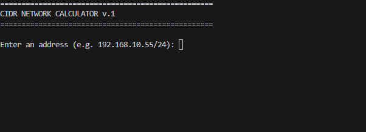
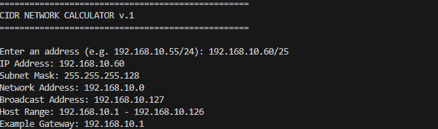
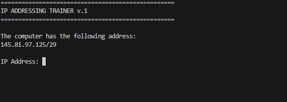
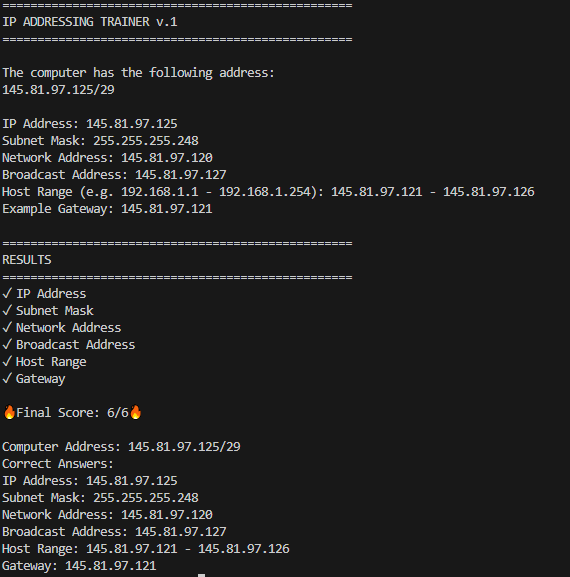
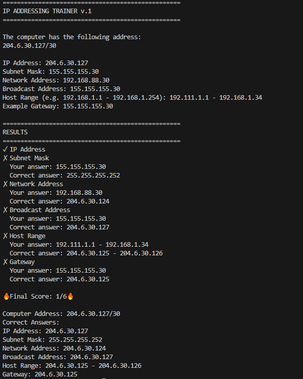

# Network CIDR Toolkit

Python toolkit for IPv4 subnet calculations and CIDR training.

The project contains two command-line applications designed for learning and practicing IPv4 addressing and CIDR notation.

## Features

* IPv4 CIDR network calculator
* Interactive CIDR training application
* Network address calculation
* Subnet mask calculation
* Broadcast address calculation
* First usable host calculation
* Last usable host calculation
* Example gateway suggestion
* Random subnet exercises
* Automatic answer validation
* Score calculation
* Command-line interface (CLI)

## Included Applications

### `calculator_network_CIDR.py`

A command-line IPv4 subnet calculator.

The program accepts an IPv4 address with a CIDR prefix and calculates:

* IP address
* Subnet mask
* Network address
* Broadcast address
* First usable host
* Last usable host
* Example gateway

### Example

Input:

```text
192.168.10.55/24
```

Output:

```text
IP Address: 192.168.10.55
Subnet Mask: 255.255.255.0
Network Address: 192.168.10.0
Broadcast Address: 192.168.10.255
Host Range: 192.168.10.1 - 192.168.10.254
Example Gateway: 192.168.10.1
```

### Screenshots

#### Calculator — Input



#### Calculator — Result



---

### `Trening_network_CIDR.py`

Interactive command-line training application for practicing IPv4 subnet calculations.

The program generates a random IPv4 address with a CIDR prefix and asks the user to calculate:

* IP address
* Subnet mask
* Network address
* Broadcast address
* Host range
* Example gateway

The application then compares the user's answers with the correct values and calculates a final score.

### Training Screenshots

#### Training — Input



#### Correct Answers



#### Incorrect Answers



## Technologies

* Python 3
* `ipaddress`
* `random`
* Command Line Interface (CLI)

## Requirements

Python 3.x is required.

The training application uses Python's built-in `ipaddress` module.

No external packages are required.

## Run

Clone the repository:

```bash
git clone https://github.com/JakubG-code/Network-CIDR-Toolkit.git
```

Navigate to the project directory:

```bash
cd Network-CIDR-Toolkit
```

Run the calculator:

```bash
python calculator_network_CIDR.py
```

Run the training application:

```bash
python Trening_network_CIDR.py
```

## Project Structure

```text
Network-CIDR-Toolkit/
│
├── calculator_network_CIDR.py
├── Trening_network_CIDR.py
├── LICENSE
├── README.md
│
└── images/
    ├── Calc-input.PNG
    ├── Calc-result.PNG
    ├── trening-input.PNG
    ├── trening-results-correct.PNG
    └── trening-results-wrong.PNG
```

## Learning Purpose

This project was created as a practical exercise in:

* IPv4 addressing
* CIDR notation
* subnet masks
* network and broadcast addresses
* usable host ranges
* basic Python networking logic
* command-line application development

## Future Improvements

Possible future improvements:

* IPv6 support
* VLSM calculator
* Binary subnet representation
* Subnet visualization
* Export results to CSV
* Graphical user interface
* Difficulty levels for CIDR training
* Additional subnetting exercises

## License

MIT License
